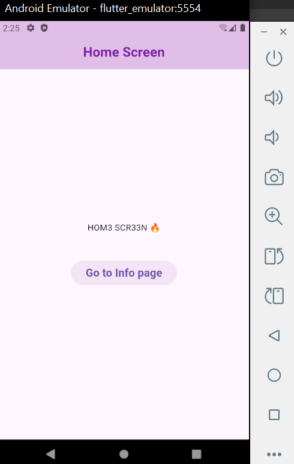

# Week1 Task 3: Navigation Between Screens:

    Create a second screen (e.g., Home Screen).
        ○ Implement navigation from the login screen to the home screen using:
            Navigator.push().

            