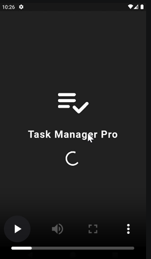

# Task Management App

A professional, feature-rich, and lightweight Task Management application built using Flutter. This app helps users easily manage their daily activities by adding, tracking, deleting, and marking tasks as complete, with data persistence so your tasks are never lost.

---

## 🚀 Features

- **Splash Screen:** A beautiful and interactive intro screen on app startup.
- **Custom AppBar:** Enhanced UI with a dedicated title and a quick action button to add tasks.
- **Task Management:** Seamlessly add new tasks, mark tasks as completed (with a strike-through effect), and delete tasks.
- **Data Persistence:** Uses `SharedPreferences` to securely save and load your tasks locally on the device. The data stays safe even after restarting the app.
- **Clean Architecture:** Built using a professional **Feature-First / Model-Screen** folder structure for scalability and readable code.

---

##  DEMO
- **Click the below image to watch the demo:** if somehow video isn't work so check its in assets folder.

[](assets/task_management_app_demo.mp4)

## 📂 Project Structure

The project follows a standard and professional directory layout under the `lib/` folder:

```text
lib/
│
├── models/
│   └── task_model.dart          # Defines the Task structure and JSON encoding/decoding
│
├── screens/
│   ├── splash_screen.dart       # App introduction screen with a 3-second delay
│   └── todo_list_screen.dart    # Main interactive dashboard for managing tasks
│
└── main.dart                    # Application entry point with native bindings initialized